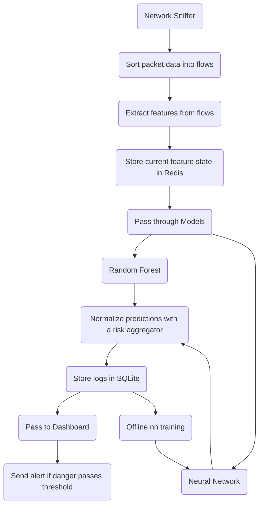

# System Design Document
## 1. Overview
This system monitors network traffic in real-time, extracts flow-level features, and uses machine learning models to assess security risks.  
Alerts are generated when risk thresholds are exceeded, and historical logs are stored for offline training and analysis.

## 2. Architecture
### 2.1 Packet Capture
Purpose: Capture raw network packets from the interface.  
Input: Network interface packets.  
Output: Raw packets to be processed into flows.  
Dependencies/Tools: Scapy  
Constraints: Must handle high packet throughput without dropping data.
### 2.2 Flow Table
Purpose: Organize packets into flows (by 5-tuple: src/dst IP, src/dst port, protocol).  
Input: Packets from Packet Capture.  
Output: Flow objects stored in memory/Redis.  
Constraints: Flows may expire after inactivity.  
Data Structures: Dictionaries, hashmaps, or Redis key-value storage.
### 2.3 Feature Extraction
Purpose: Convert flows into numerical features for ML models.  
Input: Flow objects.  
Output: Feature vectors (e.g., packet counts, byte counts, inter-arrival times).  
Considerations: Normalization/scaling may be needed.  
  
The Feature Extraction subsystem converts flow objects into a fixed-length feature vector defined  
in the Feature Specification document **docs/feature_spec.md**. This vector is used by both the  
Random Forest and Neural Network models and is stored in Redis for live inference and SQLite for offline training.
### 2.4 Model Inference
Purpose: Pass features through trained ML models to detect anomalies.  
Input: Feature vectors  
Output: Risk score in range [0,1]  
Models: Random Forest, Neural Network  
Considerations: Batch vs. live inference; latency requirements.  
### 2.5 Risk Aggregation
Purpose: Combine predictions from multiple models to compute a unified risk score.  
Input: Model outputs.  
Output: Normalized risk score.  
Logic: Weighted averaging, max function, or custom aggregator.
### 2.6 Dashboard
Purpose: Display risk alerts and flow statistics to the user.  
Input: Risk scores, logs from SQLite.  
Output: Visual alerts, dashboards.  
Considerations: Refresh rates, user interactivity, filtering options.
## 3. Storage
SQLite: Stores long-term logs coming for offline analysis and retraining  
SQLite table: flow_logs(flow_id, timestamp, features, label)  
Redis: Stores recent network traffic features for live inference  
Redis Key: flow:{flow_id} -> current feature vector
## 4. Offline Training
Purpose: Retrain Neural Network using historical flow data.  
Input: Logs from SQLite.  
Output: Updated model weights.  
Schedule: Periodic retraining or manual trigger.
## 5. Security & Performance Considerations
Security: Avoid logging sensitive payloads; encrypt model logs if needed.  
Performance: Minimize inference latency; Redis for quick feature lookup.