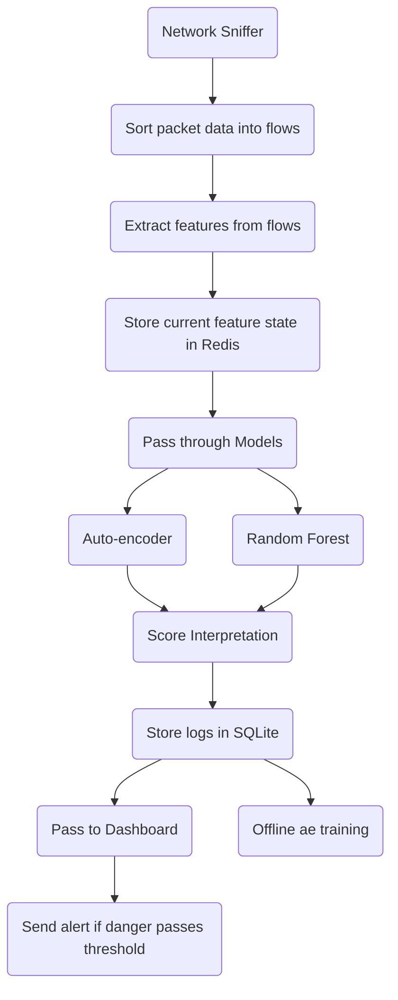

# System Design Document
## 1. Overview
This document describes the system architecture for a real-time Network Intrusion Detection System (NIDS). 
It is intended for developers contributing to the project and technical reviewers evaluating the design. 
The document covers the core pipeline components — packet capture, flow aggregation, feature extraction, ML inference, alerting, and storage — 
as well as offline retraining and performance considerations. It does not cover model training methodology or feature definitions in depth; 
those are addressed in [Model Plan](docs/model_plan.md) and [Feature Specs](docs/feature_spec.md) respectively. 
Architecture Decision Records for key design choices can be found in [ADR](docs/adr/).

## 2. Architecture
### 2.1 Packet Capture
Purpose: Capture raw network packets from the interface.  
Input: Network interface packets.  
Output: Raw packets to be processed into flows.  
Dependencies/Tools: LibPcap.  
Constraints: Packet throughput is very high - it must handle it with low latency and without dropping data
### 2.2 Flow Table
**Flows will be organized by 6-tuple: (epoch ID, src/dst IP, src/dst port, protocol)**  
**Epoch ID is incremented per-flow each time the given flow is timed-out**  
Purpose: Organize packets into flows. 
Input: Packets from Packet Capture.  
Output: Flow objects stored in memory/Redis.  
Constraints: Flows may expire after inactivity.  
Data Structures: Dictionaries, hashmaps, or Redis key-value storage.
### 2.3 Feature Extraction
Purpose: Convert flows into numerical features for ML models.  
Input: Flow objects.  
Output: Feature vectors (e.g., packet counts, byte counts, inter-arrival times).  
Considerations: Normalization/scaling may be needed.  
  
The Feature Extraction subsystem converts flow objects into a fixed-length feature vector defined  
in the Feature Specification document [Feature Specs](docs/feature_specs.md). This vector is used by both the  
Random Forest and Auto-encoder models and is stored in Redis for live inference and SQLite for offline training.
### 2.4 Model Inference
Purpose: Pass features through trained ML models to detect anomalies.  
Input: Feature vectors  
Output: Risk score random forest and reconstruction error from auto-encoder in range [0, infinity)  
Models: Random Forest, Auto-encoder  
Considerations: Batch vs. live inference; latency requirements.  
### 2.5 Score Interpretation
Purpose: Translate scores into a risk category and percentage chance of anomaly.  
Input: Model outputs.  
Output: Auto-encoder anomaly percentage and risk category; Random forest risk category.
### 2.6 Dashboard
Purpose: Display risk alerts and flow statistics to the user.  
Input: Risk scores, logs from SQLite.  
Output: Visual alerts, dashboards.  
Considerations: Refresh rates, user interactivity, filtering options.
## 3. Storage
SQLite: Stores long-term logs coming for offline analysis and retraining
SQLite table: flow_logs(flow_id, timestamp, features)
Redis: Stores recent network traffic features for live inference
Redis Key: flow:{flow_id} -> current feature vector
Purpose: Periodically retrain the Autoencoder using historical flow data accumulated in SQLite, 
allowing the model to adapt to shifts in baseline network behavior over time.

## 4. Offline 
Input: Flow logs from the flow_logs SQLite table, filtered to benign-labeled records for unsupervised retraining.
Output: Updated Autoencoder weights saved to models/artifacts/.
Rationale: The Autoencoder is an unsupervised anomaly detector: 
it learns a compressed representation of normal traffic and flags flows that deviate significantly from that representation. 
Because network traffic patterns shift over time (new services, changing usage patterns, infrastructure updates), 
a static model will gradually accumulate false positives as legitimate traffic drifts outside its learned distribution. 
Periodic retraining on recent benign traffic keeps the reconstruction baseline current. 
The Random Forest is not retrained in this loop because it is a supervised classifier trained on a fixed labeled dataset (CIC-IDS-2017); 
retraining it would require newly labeled attack data, which is not passively available at runtime.

Schedule: Retraining can be triggered manually or on a configurable schedule. 
The retraining script reads from SQLite, preprocesses features using the same normalization pipeline used during live inference, and overwrites the model artifact on completion.
Constraints: Retraining should only use data from a recent time window to avoid stale traffic patterns dominating the learned distribution. Care should be taken to exclude any flows flagged as malicious from the retraining set, as including attack traffic would corrupt the model's baseline.
## 5. Security & Performance Considerations
Security:
Raw packet payloads are never logged or stored, only behavioral flow features are retained. 
This is both a privacy consideration and a practical one, as payload inspection would introduce significant latency and storage overhead. 
If flow logs are stored on shared infrastructure, encryption of the SQLite database should be considered. 
Model artifacts should be treated as sensitive, since a compromised model could be used to understand the system's detection blind spots.

Performance:
The system is designed for low-latency inference on completed flows. 
Redis is used as an intermediate feature store to decouple the capture and inference processes, 
enabling future multi-process scaling where capture and inference run in parallel. 
The two models have meaningfully different latency profiles: the Random Forest produces near-instantaneous predictions, 
while the Autoencoder involves a forward pass through a neural network and is slightly more expensive. 
Both are expected to operate well within acceptable latency bounds for flow-level (rather than packet-level) inference. 
Bottlenecks are most likely to occur at the packet capture and flow aggregation stage under high-throughput conditions; 
this is the primary constraint motivating the planned multi-process architecture.